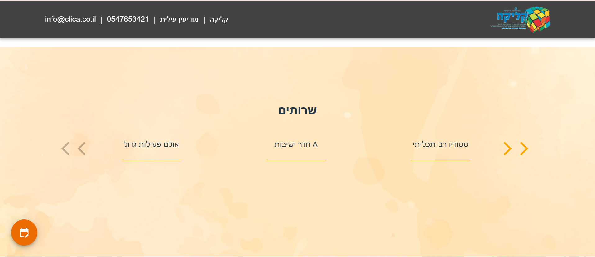
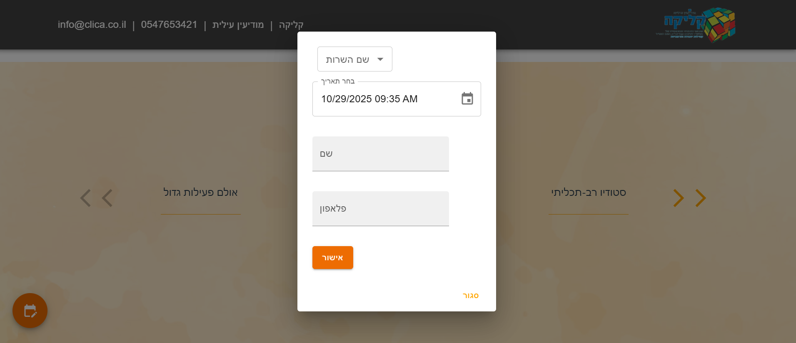

<p align="center">
  
</p>

<h1 align="center">🏢 Clica Room Rental</h1>

<p align="center">
  A modern full-stack web application for managing and booking rooms for business or personal use.<br/>
  View available rooms, schedule meetings, and manage your business services through an intuitive admin area.
</p>

---

## 🏡 About The Project

**Clica Room Rental** is a responsive web platform designed to simplify the management and booking of rooms.  
Users can browse available rooms, view details, and schedule appointments easily.  
The admin has a private dashboard (accessible by adding `/admin` to the URL) for managing rooms, services, and meetings.

#### ✨ Key Features
- 🏠 **Room listings** — view available rooms with full details (capacity, rate, amenities)  
- 📅 **Meeting scheduling** — book a room and confirm appointments  
- 👤 **Admin dashboard** — add, edit, or delete rooms and services  
- 🏢 **Business management** — update business name and contact information  
- 🔐 **Admin access** via `/admin` path with username `admin` and password `1234`  
- ⚙️ **Full-stack architecture** — React + Node.js + Express

---

## 🧩 Built With

- **Frontend:** ⚛️ React (Vite)  
- **Backend:** 🧱 Node.js + Express  
- **State Management:** 🧭 MobX  
- **UI Library:** 🎨 Material UI (MUI)  
- **Date Management:** 🗓️ Day.js  

---

## 🖼️ Screenshots

| Home Page | Login | Make Meeting |
|------------|---------------|----------------|
|  |  |  |

<p align="center">
  <a href="https://github.com/YochevedRot/Clica-Room-Rental/tree/main/images">📸 View More Screenshots</a>
</p>

---

## 🚀 Getting Started

#### 1️⃣ Clone the repository
```bash
git clone https://github.com/yourusername/Clica-Room-Rental.git
cd Clica-Room-Rental
```
#### 2️⃣ Install client dependencies and run
```bash
cd clica-client
npm install
npm run dev
```
This will launch the user-facing site at:
👉 http://localhost:5173
#### 3️⃣ Access the admin panel
To enter the admin dashboard, add /admin to the URL:
👉 http://localhost:5173/admin

Login credentials:
```bash
Username: admin  
Password: 1234
```
#### 4️⃣ Setup and run the server
```bash
cd ../clica-server
npm install
node server.js
```

---

## 🧭 Usage
- 🌐 **User site:** [http://localhost:5173](http://localhost:5173)  
- 🕒 **Book meetings** or browse rooms  
- 🔑 **Admin panel:** [http://localhost:5173/admin](http://localhost:5173/admin)  
- 👤 **Login credentials:** admin / 1234  


---

 ## 🔒 License
This project is private and may not be copied, modified, or redistributed without explicit permission from the author.

<p align="center">Made with ❤️ by <a href="https://github.com/YochevedRot">Yocheved Rot</a></p> 
